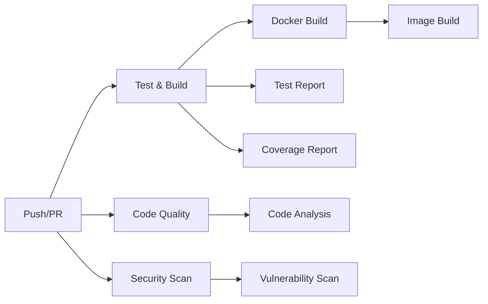
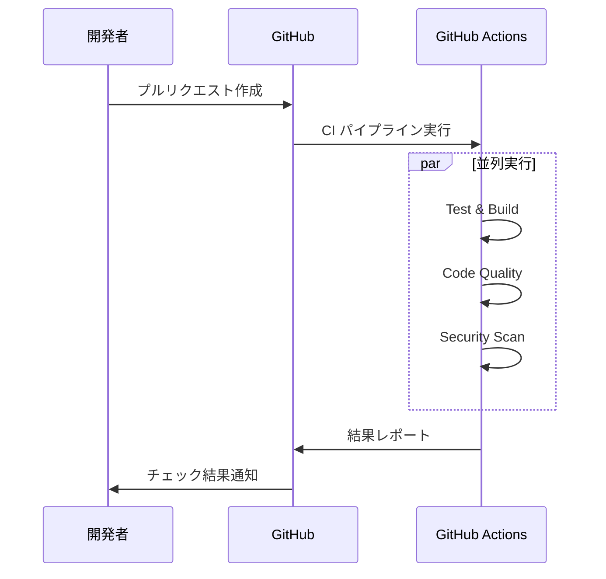
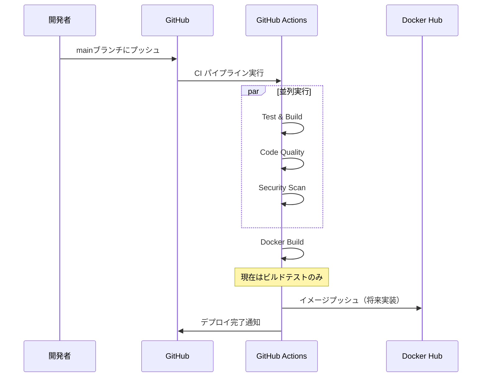

# CI/CDパイプライン設計書

## 概要

LoginDemoプロジェクトでは、GitHub Actionsを使用した自動化されたCI/CDパイプラインを実装しています。
コードの品質保証、セキュリティチェック、自動デプロイを通じて、エンタープライズレベルの開発プロセスを実現しています。

## パイプライン構成

### 実行トリガー

```yaml
on:
  push:
    branches: [ main, develop ]  # メインブランチへのプッシュ時
  pull_request:
    branches: [ main ]           # プルリクエスト作成時
```

### ジョブ構成



## 各ジョブの詳細

### 1. Test & Build ジョブ

**目的**: アプリケーションのテスト実行とビルド

**実行内容**:
- ソースコードのチェックアウト
- JDK 17環境のセットアップ
- Gradleキャッシュの利用
- 単体テストの実行
- テストカバレッジの測定（JaCoCo）
- アプリケーションのビルド（bootJar）
- 成果物（JARファイル）のアップロード

**成果物**:
- `build/libs/*.jar` - 実行可能JARファイル
- `build/reports/jacoco/test/jacocoTestReport.xml` - カバレッジレポート
- `build/test-results/test/*.xml` - テスト結果

**実行時間**: 約2-3分

### 2. Code Quality ジョブ

**目的**: コード品質の検証

**実行内容**:
- 基本的なコンパイルチェック
- 将来的な拡張機能（現在はコメントアウト）:
  - SpotBugsによる静的解析
  - Checkstyleによるコーディング規約チェック
  - SonarQubeによる総合品質分析

**設定状況**:
```yaml
# 現在は基本的なコンパイルチェックのみ実行
- name: Run basic code analysis
  run: ./gradlew compileJava
  continue-on-error: true
```

### 3. Security Scan ジョブ

**目的**: セキュリティ脆弱性の検出

**実行内容**:
- **Trivy**: ファイルシステムスキャン
  - 依存関係の脆弱性検出
  - SARIF形式でのレポート生成
  - GitHub Security tab への結果アップロード

- **OWASP Dependency Check**: 依存関係分析
  - 既知の脆弱性データベースとの照合
  - HTML形式のレポート生成

**成果物**:
- `trivy-results.sarif` - Trivyスキャン結果
- `reports/` - OWASP依存関係チェック結果

### 4. Docker Build ジョブ

**目的**: Dockerイメージのビルドとテスト

**実行条件**: 
- `test`ジョブが成功
- `main`ブランチへのプッシュ時のみ

**実行内容**:
- Docker Buildxのセットアップ
- マルチステージビルドによるイメージ作成
- GitHub Actionsキャッシュの利用
- 現在はビルドテストのみ（プッシュは無効化）

**将来的な機能**（現在はコメントアウト）:
- Docker Hubへの自動プッシュ
- `latest`タグとcommit SHAタグの生成

## 実行フロー

### 1. プルリクエスト時



### 2. メインブランチプッシュ時



## 品質ゲート

### 必須条件
- ✅ 全テストが成功
- ✅ アプリケーションが正常にビルド可能
- ✅ Dockerイメージがビルド可能

### 推奨条件
- ⚠️ テストカバレッジ70%以上（目標値）
- ⚠️ セキュリティスキャンで重大な脆弱性なし
- ⚠️ コード品質チェック通過

## 環境変数とシークレット

### 必要なシークレット（将来設定予定）

```yaml
# GitHub リポジトリ設定 → Settings → Secrets
DOCKER_USERNAME: Docker Hubユーザー名
DOCKER_PASSWORD: Docker Hubパスワード
SONAR_TOKEN: SonarCloudトークン
```

### 環境変数

```yaml
# テスト実行時
SPRING_PROFILES_ACTIVE: test

# 将来的なSonarQube設定
SONAR_PROJECT_KEY: logindemo
SONAR_ORGANIZATION: your-org
SONAR_HOST_URL: https://sonarcloud.io
```

## パフォーマンス最適化

### キャッシュ戦略

**Gradleキャッシュ**:
```yaml
- name: Set up JDK 17
  uses: actions/setup-java@v4
  with:
    cache: gradle  # 依存関係キャッシュ
```

**Dockerキャッシュ**:
```yaml
- name: Build Docker image
  uses: docker/build-push-action@v5
  with:
    cache-from: type=gha     # GitHub Actionsキャッシュから読み込み
    cache-to: type=gha,mode=max  # GitHub Actionsキャッシュに保存
```

### 実行時間の最適化

- **並列実行**: Test、Code Quality、Security Scanを並列実行
- **条件分岐**: Docker BuildはmainブランチのみでneedsBuild
- **continue-on-error**: 非必須チェックはエラーでも継続

## レポートとアーティファクト

### 生成されるレポート

1. **テストレポート**
   - JUnit XML形式
   - GitHub Actions内で結果表示
   - 失敗時の詳細情報

2. **カバレッジレポート**
   - JaCoCo XML/HTML形式
   - Codecovへのアップロード（設定済み）

3. **セキュリティレポート**
   - SARIF形式（Trivy）
   - HTML形式（OWASP）
   - GitHub Security tabで閲覧可能

4. **ビルド成果物**
   - 実行可能JARファイル
   - 7日間保持

## トラブルシューティング

### よくある問題と解決方法

**1. Gradleビルドエラー**
```bash
# ローカルでの確認方法
./gradlew clean build

# 権限エラーの場合
chmod +x gradlew
```

**2. Dockerビルドエラー**
```bash
# ローカルでの確認方法
docker build -t logindemo:test .

# キャッシュクリア
docker system prune -a
```

**3. テスト失敗**
```bash
# 特定のテストのみ実行
./gradlew test --tests "com.example.demo.controller.AuthControllerTest"

# テスト結果の確認
cat build/test-results/test/TEST-*.xml
```

### デバッグ方法

**パイプライン実行ログの確認**:
1. GitHub → Actions タブ
2. 失敗したワークフローをクリック
3. 失敗したジョブを展開
4. エラーメッセージを確認

**ローカルでの再現**:
```bash
# CIと同じ環境での実行
export SPRING_PROFILES_ACTIVE=test
./gradlew clean test jacocoTestReport bootJar
```

## 今後の拡張計画

### フェーズ1: 品質強化
- [ ] SpotBugs設定ファイルの作成と有効化
- [ ] Checkstyle設定ファイルの作成と有効化
- [ ] SonarCloudとの連携設定

### フェーズ2: デプロイ自動化
- [ ] Docker Hub自動プッシュの有効化
- [ ] AWS/GCP等へのデプロイパイプライン
- [ ] 本番環境への自動デプロイ

### フェーズ3: 監視・通知
- [ ] Slack/Teams通知の追加
- [ ] メトリクス収集とダッシュボード
- [ ] 失敗時の自動ロールバック

## 参考資料

- [GitHub Actions Documentation](https://docs.github.com/en/actions)
- [Docker Build Push Action](https://github.com/docker/build-push-action)
- [JaCoCo Gradle Plugin](https://docs.gradle.org/current/userguide/jacoco_plugin.html)
- [OWASP Dependency Check](https://owasp.org/www-project-dependency-check/)
- [Trivy Security Scanner](https://github.com/aquasecurity/trivy)

---

**作成日**: 2025-06-30  
**作成者**: LoginDemo開発チーム  
**バージョン**: 1.0