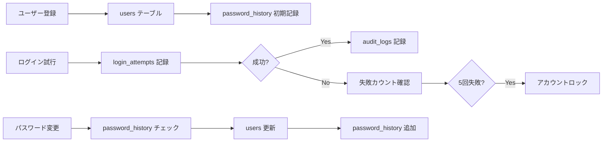

# データベース設計書

## H2データベースの基本

### H2コンソールへのアクセス方法
1. アプリケーションを起動
2. ブラウザで `http://localhost:8080/h2-console` にアクセス
3. 接続情報を入力：
   - JDBC URL: `jdbc:h2:mem:testdb`
   - User Name: `sa`
   - Password: （空欄）

## テーブル構成

### 1. users テーブル（ユーザー基本情報）
```sql
CREATE TABLE users (
    id BIGINT PRIMARY KEY AUTO_INCREMENT,
    username VARCHAR(255) UNIQUE NOT NULL,
    password VARCHAR(255) NOT NULL,
    email VARCHAR(255) UNIQUE NOT NULL,
    enabled BOOLEAN DEFAULT TRUE,
    account_non_locked BOOLEAN DEFAULT TRUE,
    mfa_enabled BOOLEAN DEFAULT FALSE,
    mfa_secret VARCHAR(255),
    created_at TIMESTAMP,
    updated_at TIMESTAMP
);
```

**役割**: ユーザーの基本情報とログイン認証情報を管理

### 2. login_attempts テーブル（ログイン試行記録）
```sql
CREATE TABLE login_attempts (
    id BIGINT PRIMARY KEY AUTO_INCREMENT,
    username VARCHAR(255) NOT NULL,
    ip_address VARCHAR(45),
    success BOOLEAN NOT NULL,
    failure_reason VARCHAR(255),
    attempted_at TIMESTAMP NOT NULL,
    INDEX idx_username_attempted (username, attempted_at)
);
```

**役割**: ログイン試行を記録し、ブルートフォース攻撃を防ぐ

### 3. password_history テーブル（パスワード履歴）
```sql
CREATE TABLE password_history (
    id BIGINT PRIMARY KEY AUTO_INCREMENT,
    user_id BIGINT NOT NULL,
    password_hash VARCHAR(255) NOT NULL,
    created_at TIMESTAMP NOT NULL,
    FOREIGN KEY (user_id) REFERENCES users(id)
);
```

**役割**: 過去のパスワードを記録し、再利用を防ぐ

### 4. audit_logs テーブル（監査ログ）
```sql
CREATE TABLE audit_logs (
    id BIGINT PRIMARY KEY AUTO_INCREMENT,
    username VARCHAR(255),
    action VARCHAR(100) NOT NULL,
    details TEXT,
    ip_address VARCHAR(45),
    user_agent TEXT,
    timestamp TIMESTAMP NOT NULL,
    INDEX idx_username_timestamp (username, timestamp)
);
```

**役割**: すべてのセキュリティ関連イベントを記録

### 5. backup_codes テーブル（バックアップコード）
```sql
CREATE TABLE backup_codes (
    id BIGINT PRIMARY KEY AUTO_INCREMENT,
    user_id BIGINT NOT NULL,
    code VARCHAR(255) NOT NULL,
    used BOOLEAN DEFAULT FALSE,
    created_at TIMESTAMP,
    used_at TIMESTAMP,
    FOREIGN KEY (user_id) REFERENCES users(id)
);
```

**役割**: MFAデバイスを紛失した場合の復旧用コード

### 6. oauth2_user_links テーブル（OAuth2連携）
```sql
CREATE TABLE oauth2_user_links (
    id BIGINT PRIMARY KEY AUTO_INCREMENT,
    user_id BIGINT NOT NULL,
    provider VARCHAR(50) NOT NULL,
    provider_user_id VARCHAR(255) NOT NULL,
    linked_at TIMESTAMP,
    UNIQUE KEY uk_provider_user (provider, provider_user_id),
    FOREIGN KEY (user_id) REFERENCES users(id)
);
```

**役割**: 外部認証プロバイダーとの連携情報

## データの流れ



## JPA Entityとの対応

| テーブル名 | Entityクラス | Repositoryインターフェース |
|-----------|-------------|------------------------|
| users | User.java | UserRepository.java |
| login_attempts | LoginAttempt.java | LoginAttemptRepository.java |
| password_history | PasswordHistory.java | PasswordHistoryRepository.java |
| audit_logs | AuditLog.java | AuditLogRepository.java |
| backup_codes | BackupCode.java | BackupCodeRepository.java |
| oauth2_user_links | OAuth2UserLink.java | OAuth2UserLinkRepository.java |

## 開発時の確認方法

1. **SQLログの確認**
   - `application.properties` の `spring.jpa.show-sql=true` で実行SQLを表示

2. **H2コンソールでのデータ確認**
   ```sql
   -- 全ユーザー表示
   SELECT * FROM users;
   
   -- ログイン失敗履歴
   SELECT * FROM login_attempts WHERE success = FALSE ORDER BY attempted_at DESC;
   
   -- 監査ログ確認
   SELECT * FROM audit_logs ORDER BY timestamp DESC LIMIT 10;
   ```

3. **テーブル構造の確認**
   ```sql
   -- テーブル一覧
   SHOW TABLES;
   
   -- テーブル定義確認
   SHOW COLUMNS FROM users;
   ```