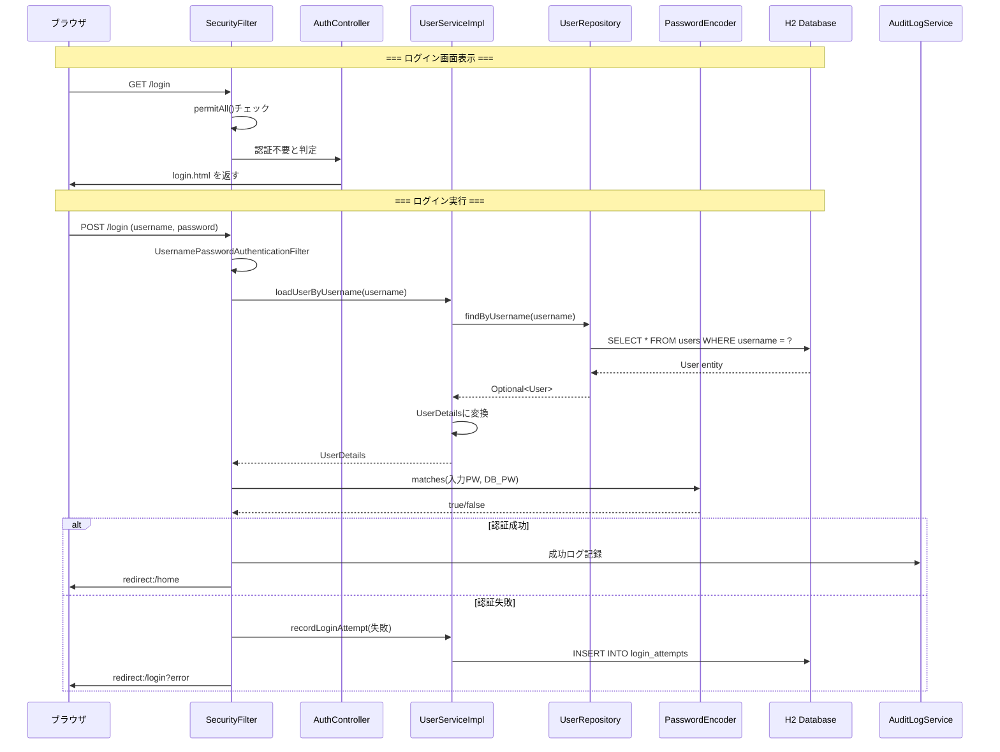

# ログイン機能の完全フロー図

## 🔐 ログイン処理の詳細フロー

### シーケンス図で見るログイン



## 📋 クラス間の依存関係

```mermaid
graph TB
    subgraph "Presentation Layer"
        AC[AuthController<br/>@Controller]
    end

    subgraph "Business Layer"
        US[UserServiceImpl<br/>@Service]
        FS[FormTokenService<br/>@Service]
        AL[AuditLogService<br/>@Service]
        RL[RateLimitService<br/>@Service]
    end

    subgraph "Data Access Layer"
        UR[UserRepository<br/>@Repository]
        LR[LoginAttemptRepository<br/>@Repository]
        AR[AuditLogRepository<br/>@Repository]
    end

    subgraph "Database"
        UT[(users table)]
        LT[(login_attempts table)]
        AT[(audit_logs table)]
    end

    subgraph "Spring Security"
        SF[SecurityFilterChain]
        PE[PasswordEncoder]
    end

    AC -->|@RequiredArgsConstructor| US
    AC -->|@RequiredArgsConstructor| FS

    US -->|@RequiredArgsConstructor| UR
    US -->|@RequiredArgsConstructor| LR
    US -->|@RequiredArgsConstructor| AL
    US -->|@RequiredArgsConstructor| RL
    US -->|@RequiredArgsConstructor| PE

    UR -->|extends JpaRepository| UT
    LR -->|extends JpaRepository| LT
    AR -->|extends JpaRepository| AT

    AL -->|@RequiredArgsConstructor| AR

    SF -->|uses| US
    SF -->|uses| PE
```

## 🎯 実際のコードと対応

### 1. ブラウザ → Controller

```java
// ブラウザ: <form action="/login" method="post">
//           <input name="username" value="user1">
//           <input name="password" value="pass123">

@Controller
public class AuthController {
    @GetMapping("/login")  // ← GET /login でこのメソッド実行
    public String loginPage() {
        return "login";    // ← templates/login.html を表示
    }
}
```

### 2. Spring Security の自動処理

```java
// SecurityConfig.java での設定
@Bean
public SecurityFilterChain filterChain(HttpSecurity http) {
    http
        .formLogin(form -> form
            .loginPage("/login")        // ← カスタムログインページ
            .usernameParameter("username")
            .passwordParameter("password")
            .defaultSuccessUrl("/home", true)
        );
}

// これにより POST /login は Spring Security が自動処理
```

### 3. UserService での認証

```java
@Service
@RequiredArgsConstructor
public class UserServiceImpl implements UserDetailsService {
    private final UserRepository userRepository;
    
    @Override
    public UserDetails loadUserByUsername(String username) {
        // 1. DBからユーザー検索
        User user = userRepository.findByUsername(username)
            .orElseThrow(() -> new UsernameNotFoundException("User not found"));
        
        // 2. Spring Security用のUserDetailsに変換
        return org.springframework.security.core.userdetails.User
            .withUsername(user.getUsername())
            .password(user.getPassword())  // ← 暗号化済みパスワード
            .accountLocked(!user.isAccountNonLocked())
            .build();
    }
}
```

### 4. Repository → Database

```java
@Repository
public interface UserRepository extends JpaRepository<User, Long> {
    Optional<User> findByUsername(String username);
    // ↑ Spring Data JPAが以下のSQLを自動生成：
    // SELECT u FROM User u WHERE u.username = :username
}
```

## 🔍 ログイン失敗時の処理フロー

```
1. POST /login (間違ったパスワード)
    ↓
2. SecurityFilter が認証失敗を検知
    ↓
3. AuthenticationFailureHandler 実行
    ↓
4. UserServiceImpl.recordLoginAttempt() 呼び出し
    ↓
5. login_attempts テーブルに記録
    ↓
6. 失敗回数チェック（5回以上？）
    ↓
7-a. Yes → users.account_non_locked = false
7-b. No  → カウントのみ
    ↓
8. redirect:/login?error
```

## 💡 重要ポイント

### アノテーションによる自動接続

```java
@RequiredArgsConstructor  // Lombokが以下を生成
public class AuthController {
    private final IUserService userService;
    
    // 生成されるコンストラクタ
    public AuthController(IUserService userService) {
        this.userService = userService;
    }
}
```

### インターフェースと実装の分離

```
IUserService (interface)
    ↑ implements
UserServiceImpl (@Service)
    ↑ Spring が自動的に注入
AuthController
```

### トランザクション境界

```java
@Service
public class UserServiceImpl {
    @Transactional  // ← ここがトランザクション境界
    public User register(User user) {
        // この中の全DB操作が1つのトランザクション
        userRepository.save(user);
        passwordHistoryService.save(...);
        auditLogService.log(...);
        // 全部成功 or 全部ロールバック
    }
}
```