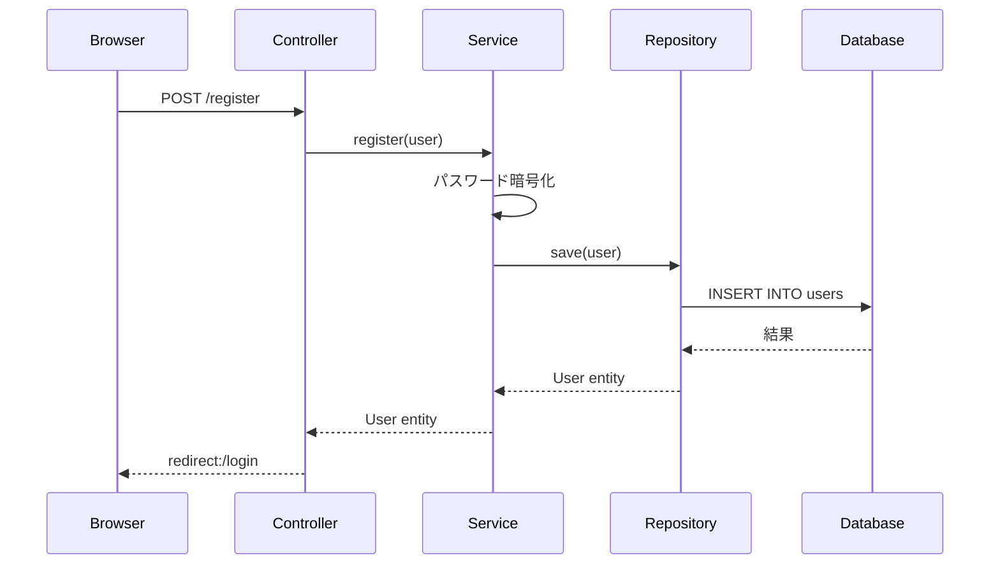

# Spring Boot アーキテクチャ解説

## 1. Spring Bootの基本概念

### Spring Bootとは
- **設定より規約**: 最小限の設定で動作
- **自動設定**: @SpringBootApplicationが多くを自動化
- **組み込みサーバー**: Tomcatが内蔵されている

## 2. レイヤードアーキテクチャ

```
┌─────────────────────────────────────────────┐
│           Presentation Layer                 │
│         (Controller + View)                  │
├─────────────────────────────────────────────┤
│           Business Layer                     │
│            (Service)                         │
├─────────────────────────────────────────────┤
│         Data Access Layer                    │
│          (Repository)                        │
├─────────────────────────────────────────────┤
│           Database                           │
│         (H2 / PostgreSQL)                    │
└─────────────────────────────────────────────┘
```

## 3. 各層の役割と実装例

### Controller層（プレゼンテーション層）
**役割**: HTTPリクエストを受け取り、レスポンスを返す

```java
@Controller
@RequiredArgsConstructor
public class AuthController {
    private final IUserService userService;  // サービス層を注入
    
    @GetMapping("/login")
    public String loginPage() {
        return "login";  // templates/login.html を返す
    }
    
    @PostMapping("/register")
    public String register(@ModelAttribute User user) {
        userService.register(user);  // ビジネスロジックはサービスに委譲
        return "redirect:/login";
    }
}
```

### Service層（ビジネス層）
**役割**: ビジネスロジックを実装

```java
@Service
@RequiredArgsConstructor
@Transactional
public class UserServiceImpl implements IUserService {
    private final UserRepository userRepository;  // Repository層を注入
    private final PasswordEncoder passwordEncoder;
    
    public User register(User user) {
        // ビジネスロジック
        if (userRepository.existsByUsername(user.getUsername())) {
            throw new IllegalArgumentException("ユーザー名は既に使用されています");
        }
        
        // パスワードの暗号化
        user.setPassword(passwordEncoder.encode(user.getPassword()));
        
        // データ層に保存を依頼
        return userRepository.save(user);
    }
}
```

### Repository層（データアクセス層）
**役割**: データベースとのやり取り

```java
@Repository
public interface UserRepository extends JpaRepository<User, Long> {
    // Spring Data JPAが実装を自動生成
    Optional<User> findByUsername(String username);
    boolean existsByUsername(String username);
}
```

### Entity（データモデル）
**役割**: データベーステーブルとJavaオブジェクトのマッピング

```java
@Entity
@Table(name = "users")
@Data
@NoArgsConstructor
@AllArgsConstructor
public class User {
    @Id
    @GeneratedValue(strategy = GenerationType.IDENTITY)
    private Long id;
    
    @Column(unique = true, nullable = false)
    private String username;
    
    @Column(nullable = false)
    private String password;
    
    // JPAが自動的にテーブルを作成
}
```

## 4. 依存性注入（DI）の仕組み

### @Autowiredと@RequiredArgsConstructor
```java
// 従来の方法
@Controller
public class OldController {
    @Autowired
    private UserService userService;
}

// 推奨される方法（Lombokを使用）
@Controller
@RequiredArgsConstructor  // finalフィールドのコンストラクタを自動生成
public class NewController {
    private final UserService userService;  // 不変性を保証
}
```

## 5. リクエスト処理の流れ



## 6. 重要なアノテーション

### 基本アノテーション
- `@SpringBootApplication`: メインクラスに付与
- `@Controller`: MVCのコントローラー
- `@Service`: ビジネスロジック
- `@Repository`: データアクセス層
- `@Component`: 汎用的なSpringコンポーネント

### マッピングアノテーション
- `@GetMapping`: GETリクエスト
- `@PostMapping`: POSTリクエスト
- `@RequestMapping`: 汎用的なマッピング

### データバインディング
- `@ModelAttribute`: フォームデータをオブジェクトに
- `@RequestParam`: URLパラメータ
- `@PathVariable`: URLパスの一部

### JPA関連
- `@Entity`: JPAエンティティ
- `@Table`: テーブル名指定
- `@Id`: 主キー
- `@Column`: カラム定義
- `@OneToMany`/`@ManyToOne`: リレーション

## 7. 設定ファイルの役割

### application.properties
```properties
# データベース設定
spring.datasource.url=jdbc:h2:mem:testdb

# JPA設定
spring.jpa.hibernate.ddl-auto=update  # テーブル自動作成
spring.jpa.show-sql=true             # SQL表示

# カスタム設定
app.security.max-failed-attempts=5
```

### 設定値の取得
```java
@Component
@ConfigurationProperties(prefix = "app.security")
@Data
public class SecurityProperties {
    private int maxFailedAttempts;  // application.propertiesから自動注入
}
```

## 8. トランザクション管理

```java
@Service
@Transactional  // クラスレベル：全メソッドがトランザクション対象
public class UserService {
    
    @Transactional(readOnly = true)  // 読み取り専用
    public User findUser(Long id) {
        return userRepository.findById(id).orElse(null);
    }
    
    @Transactional(rollbackFor = Exception.class)  // 例外時ロールバック
    public void updateUser(User user) {
        // 複数のDB操作が一つのトランザクションで実行される
        userRepository.save(user);
        auditLogRepository.save(new AuditLog(...));
    }
}
```

## 9. Spring Securityの統合

```java
@Configuration
public class SecurityConfig {
    @Bean
    public SecurityFilterChain filterChain(HttpSecurity http) {
        http
            .authorizeHttpRequests(auth -> auth
                .requestMatchers("/login", "/register").permitAll()
                .anyRequest().authenticated()
            )
            .formLogin(form -> form
                .loginPage("/login")
                .defaultSuccessUrl("/home")
            );
        return http.build();
    }
}
```