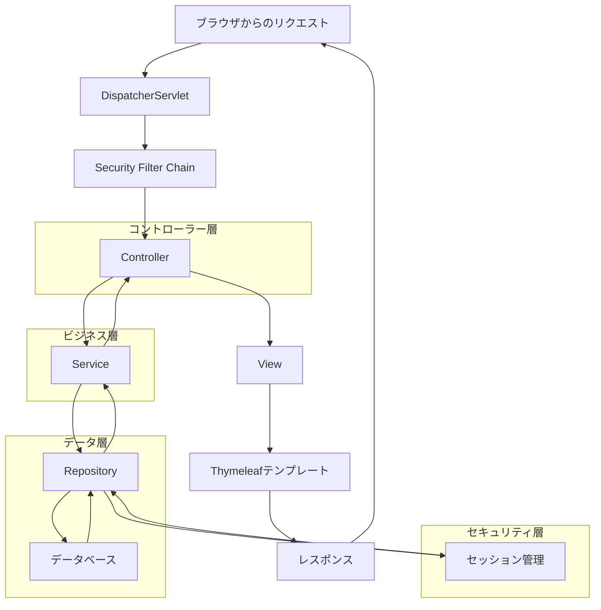
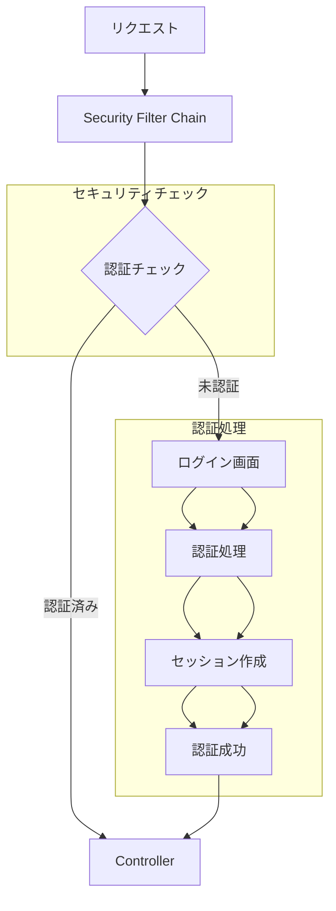
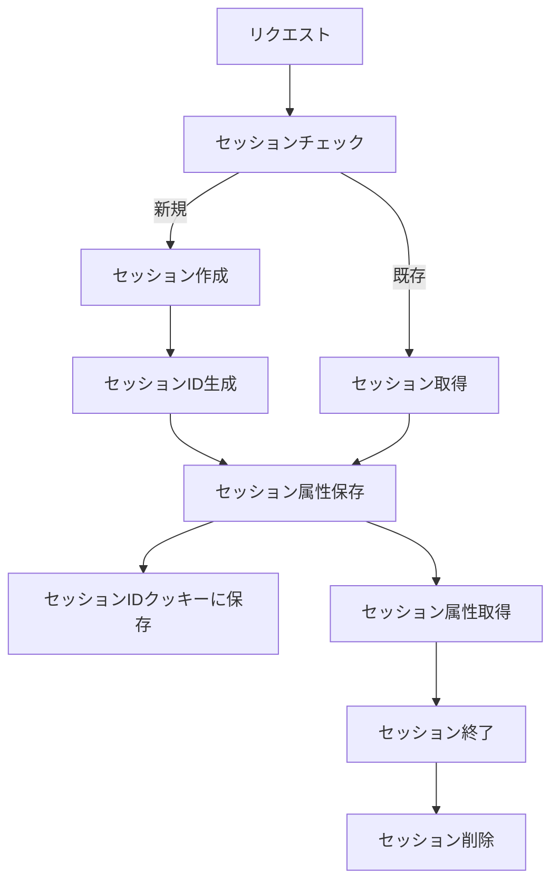
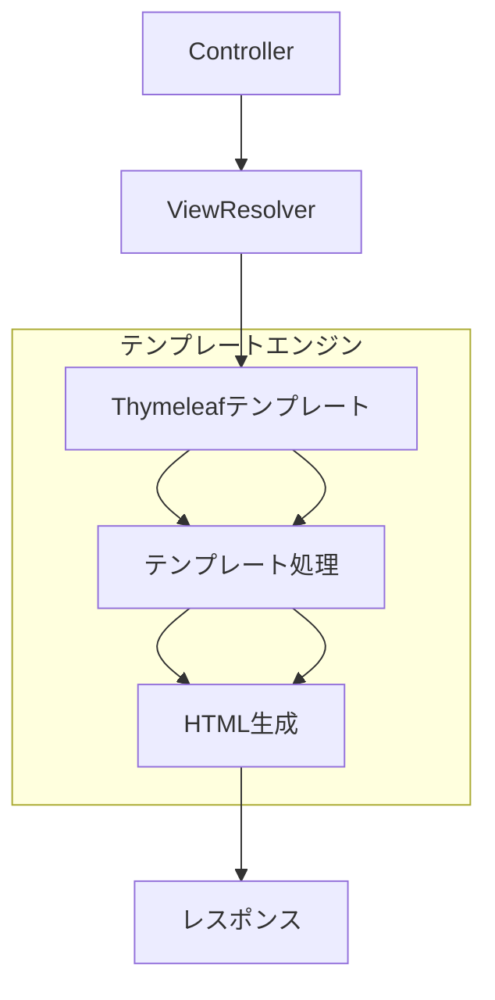
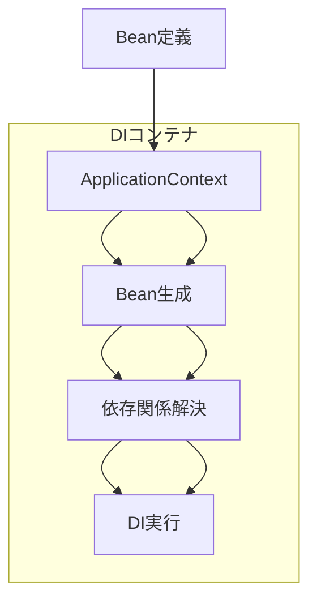

# Spring Boot アプリケーションのフロー図

## 1. MVC アーキテクチャのフロー



## 2. セキュリティフロー



## 3. データフローとDI

```mermaid
classDiagram
    class Request {
        +HttpServletRequest
        +HttpServletResponse
    }
    
    class DispatcherServlet {
        +doDispatch()
    }
    
    class Controller {
        @Autowired
        +handleRequest()
    }
    
    class Service {
        @Autowired
        +businessLogic()
    }
    
    class Repository {
        @Autowired
        +dataAccess()
    }
    
    class Session {
        +setAttribute()
        +getAttribute()
    }
    
    Request --> DispatcherServlet
    DispatcherServlet --> Controller
    Controller --> Service
    Service --> Repository
    Controller --> Session
    
    classDef spring fill:#3498db,stroke:#333,stroke-width:2px
    classDef controller fill:#e74c3c,stroke:#333,stroke-width:2px
    classDef service fill:#2ecc71,stroke:#333,stroke-width:2px
    classDef repository fill:#9b59b6,stroke:#333,stroke-width:2px
    
    class DispatcherServlet, Controller, Service, Repository
```

## アノテーションの関連性

```mermaid
classDiagram
    class Controller {
        @Controller
        @RequestMapping
        +handleRequest()
    }
    
    class Service {
        @Service
        @Transactional
        +businessLogic()
    }
    
    class Repository {
        @Repository
        @Transactional
        +dataAccess()
    }
    
    class Security {
        @EnableWebSecurity
        @Configuration
        +configure()
    }
    
    Controller --> Service
    Service --> Repository
    Security --> Controller
    
    classDef annotation fill:#f1c40f,stroke:#333,stroke-width:2px
    class Controller, Service, Repository, Security
```

## セッション管理フロー



## ビューとテンプレートエンジン



## インジェクションのフロー


