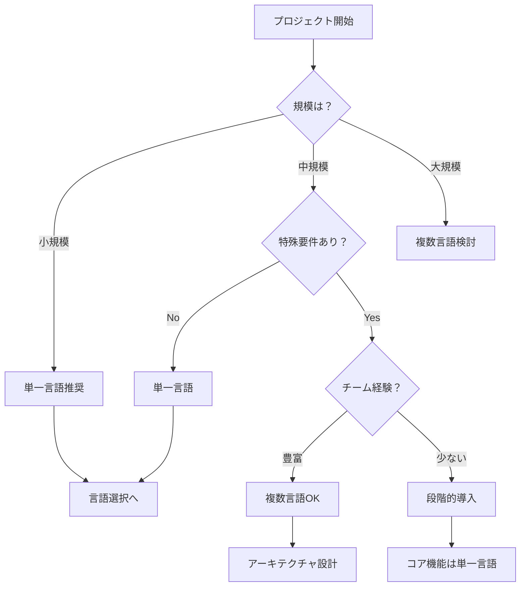

# 言語選択戦略：単一言語 vs 複数言語

## 🤔 そもそも複数言語を使うべきか？

### 単一言語の利点

```
メリット：
✅ 学習コスト最小
✅ チーム編成が楽
✅ ツールチェーン統一
✅ デバッグが簡単
✅ 採用が楽

デメリット：
❌ 最適化に限界
❌ 特定分野で不利
❌ ベンダーロックイン
```

### 複数言語の利点

```
メリット：
✅ 各分野で最適な選択
✅ パフォーマンス最適化
✅ 既存資産の活用
✅ 人材の多様性

デメリット：
❌ 複雑性増大
❌ 運用コスト増
❌ デバッグ困難
❌ 人材確保が難しい
```

## 📊 判断基準フローチャート



## 🎯 ケーススタディ

### ケース1：スタートアップ（〜10人）

**推奨：単一言語**
```
選択例：Node.js (JavaScript/TypeScript)
理由：
- フロント/バックエンド統一
- 開発速度優先
- 人材の融通が利く

構成：
Frontend: React (TypeScript)
Backend: Express (TypeScript)
Database: PostgreSQL
```

### ケース2：中規模Webサービス（10〜50人）

**推奨：2-3言語**
```
選択例：
- Frontend: TypeScript (React)
- Backend: Java (Spring Boot)
- バッチ処理: Python

理由：
- フロントエンド専門チーム
- 安定したバックエンド
- データ分析の柔軟性
```

### ケース3：大規模プラットフォーム（50人〜）

**推奨：適材適所**
```
選択例：
- Web: TypeScript
- API: Java/Go
- ML: Python
- 動画処理: C++
- インフラ: Go

理由：
- 専門チーム体制
- パフォーマンス要求
- 既存資産活用
```

## 💰 コスト比較

### 開発コスト

| 項目 | 単一言語 | 複数言語 |
|------|---------|---------|
| 初期開発 | 100 | 120-150 |
| 学習コスト | 100 | 200-300 |
| ツール準備 | 100 | 150-200 |
| **合計** | **300** | **470-650** |

### 運用コスト（年間）

| 項目 | 単一言語 | 複数言語 |
|------|---------|---------|
| 保守 | 100 | 150-200 |
| 監視 | 100 | 150 |
| 採用 | 100 | 200-300 |
| **合計** | **300** | **500-650** |

## 🏗️ 段階的移行戦略

### Phase 1：コアは単一言語
```
Spring Boot (Java)
└─ すべての機能
```

### Phase 2：フロントエンド分離
```
React (TypeScript)
    ↓ REST API
Spring Boot (Java)
└─ バックエンド機能
```

### Phase 3：特殊機能を切り出し
```
React (TypeScript)
    ↓
Spring Boot (Java)
├─ 認証・基本機能
├─ Python - ML/分析
└─ Go - 高速処理
```

### Phase 4：マイクロサービス化
```
各機能を最適な言語で実装
```

## 📝 言語別の実装速度目安

### CRUD APIの実装（工数）

| 言語 | 実装 | テスト | 合計 | 備考 |
|------|------|--------|------|------|
| Python (FastAPI) | 1.0 | 0.5 | 1.5日 | 最速 |
| Node.js (Express) | 1.5 | 0.5 | 2.0日 | 柔軟 |
| Java (Spring Boot) | 2.0 | 1.0 | 3.0日 | 堅牢 |
| Go (Gin) | 1.5 | 1.0 | 2.5日 | 高速 |
| C# (.NET) | 2.0 | 1.0 | 3.0日 | 統合 |

## 🎨 LoginDemoでの判断

### 現状分析
```
規模: 小〜中
要件: 認証、セキュリティ重視
チーム: Java経験あり
将来: 機能拡張予定
```

### 推奨案

#### 案1：Java継続（保守的）
```
利点:
- 既存資産活用
- チームスキル活用
- 安定性

構成:
- Thymeleaf → React (段階的)
- Spring Boot維持
```

#### 案2：段階的モダン化（バランス）
```
利点:
- モダンなUI
- API化で拡張性
- 段階的移行

構成:
Year 1: Spring Boot + Thymeleaf
Year 2: React + Spring Boot API
Year 3: 一部機能をGoで最適化
```

#### 案3：フルリニューアル（革新的）
```
利点:
- 最新技術
- 最適化
- 将来性

構成:
- Next.js (TypeScript)
- Go (認証API)
- Python (分析)
```

## 🚦 最終判断チェックリスト

```
ビジネス要件:
□ 開発速度が最重要 → 単一言語
□ スケーラビリティ重要 → 複数言語検討
□ 特殊処理あり（ML等） → 複数言語

チーム状況:
□ 5人以下 → 単一言語強く推奨
□ 専門チーム分け可能 → 複数言語可
□ 運用体制あり → 複数言語可

技術要件:
□ リアルタイム必須 → Go/Node.js追加
□ AI/ML必須 → Python追加
□ 高度な画像処理 → C++追加

コスト:
□ 予算限定的 → 単一言語
□ 長期的ROI重視 → 最適化検討
```

## まとめ

**「とりあえず単一言語で始めて、必要に応じて追加」が現実的**

1. まずは得意な言語で作る
2. ボトルネックを特定
3. その部分だけ最適な言語で置き換え
4. 段階的に最適化

これが最もリスクが低く、現実的なアプローチです。