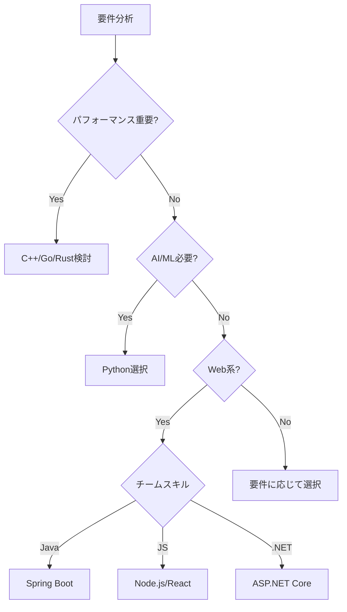

# ポリグロット・プログラミング：複数言語でシステムを作る

## 🌐 実例：大手企業のシステム構成

### Netflix の技術スタック
```
フロントエンド: JavaScript/React
API Gateway: Java/Spring Boot
レコメンドエンジン: Python（機械学習）
動画配信: C++（高速処理）
データ処理: Scala/Spark
インフラ管理: Go
```

### なぜ複数言語？
各言語の**得意分野**を活かすため！

## 🔗 複数言語はどうやって連携する？

### 1. REST API（最も一般的）
```
React (JS) 
    ↓ HTTP/JSON
Spring Boot (Java)
    ↓ HTTP/JSON
Flask (Python)
    ↓ HTTP/JSON
.NET Core (C#)
```

### 2. メッセージキュー
```
Java App → RabbitMQ → Python Worker
         ↘        ↗
           Go Service
```

### 3. gRPC（高速通信）
```proto
// 言語中立的な定義
service UserService {
    rpc GetUser(UserId) returns (User);
}

// 各言語で自動生成
→ Java クライアント
→ Python サーバー
→ Go クライアント
```

## 📊 各言語の得意分野と選択基準

### Web バックエンド

| 言語 | 得意分野 | 選ぶ理由 | 避ける理由 |
|------|---------|----------|-----------|
| **Java/Spring** | エンタープライズ | 堅牢性、実績、人材豊富 | 起動が遅い、メモリ使用量大 |
| **Python/Django** | プロトタイプ、AI連携 | 開発速度、ライブラリ豊富 | パフォーマンス、型安全性 |
| **Go** | マイクロサービス | 高速、並行処理、シンプル | エコシステムが若い |
| **Node.js** | リアルタイム、API | フロントと同じ言語、非同期 | CPU集約的処理に弱い |
| **C#/.NET** | Windows環境 | Visual Studio、Azure連携 | クロスプラットフォーム歴が浅い |

### 特殊用途

| 言語 | 最適な用途 | 実例 |
|------|-----------|------|
| **C/C++** | システムプログラミング、組み込み | OS、ゲームエンジン、動画処理 |
| **Rust** | 安全性重視のシステム | Firefox、Discord（一部） |
| **Python** | 機械学習、データ分析 | TensorFlow、pandas |
| **R** | 統計解析 | 研究、データサイエンス |
| **Scala** | ビッグデータ処理 | Apache Spark |
| **Kotlin** | Androidアプリ | モバイル開発 |

## 🏗️ 実装例：マルチ言語システム

### 例：ECサイトのアーキテクチャ

```yaml
# docker-compose.yml
version: '3.8'
services:
  # フロントエンド（React）
  frontend:
    build: ./frontend
    ports:
      - "3000:3000"
  
  # APIゲートウェイ（Spring Boot）
  api-gateway:
    build: ./api-gateway
    ports:
      - "8080:8080"
  
  # 商品検索（Elasticsearch + Python）
  search-service:
    build: ./search-service
    ports:
      - "5000:5000"
  
  # レコメンド（Python + ML）
  recommendation:
    build: ./recommendation
    ports:
      - "5001:5001"
  
  # 決済処理（Go - 高速処理）
  payment-service:
    build: ./payment
    ports:
      - "8081:8081"
  
  # 画像処理（C++ - OpenCV）
  image-processor:
    build: ./image-processor
    ports:
      - "8082:8082"
```

### 通信例

```javascript
// React Frontend
const searchProducts = async (query) => {
  // Java APIゲートウェイ経由
  const response = await fetch('/api/search', {
    method: 'POST',
    body: JSON.stringify({ query })
  });
  return response.json();
};

// Java API Gateway
@RestController
public class SearchController {
    @PostMapping("/api/search")
    public List<Product> search(@RequestBody SearchRequest request) {
        // Python検索サービスを呼び出し
        return restTemplate.postForObject(
            "http://search-service:5000/search",
            request,
            ProductList.class
        );
    }
}

// Python Search Service
from flask import Flask, request
import elasticsearch

@app.route('/search', methods=['POST'])
def search():
    query = request.json['query']
    results = es.search(index='products', body={
        'query': {'match': {'name': query}}
    })
    return jsonify(results)
```

## 🎯 言語選択の実践的基準

### 1. パフォーマンス要件

```
超高速必要 → C/C++/Rust
高速必要 → Go/Java
普通でOK → Python/Ruby/PHP
```

### 2. 開発速度

```
プロトタイプ → Python/Ruby
短期開発 → Node.js/Python
長期保守 → Java/C#
```

### 3. チームスキル

```
既存メンバーのスキル確認
├─ Java経験者多数 → Spring Boot
├─ JavaScript得意 → Node.js
└─ 新規学習OK → Go（学習コスト低）
```

### 4. エコシステム

```
AI/ML必要 → Python一択
Androidアプリ → Kotlin/Java
iOSアプリ → Swift
Windowsデスクトップ → C#
```

## 💰 工数判定の考え方

### 開発工数の計算要素

```
総工数 = 学習コスト + 実装時間 + テスト時間 + 保守コスト
```

### 言語別の目安（同じ機能を実装）

| 言語 | 学習コスト | 実装速度 | 保守性 | 総合評価 |
|------|-----------|---------|--------|---------|
| Python | ⭐ | ⭐⭐⭐⭐⭐ | ⭐⭐⭐ | 短期プロジェクト向け |
| Java | ⭐⭐⭐ | ⭐⭐⭐ | ⭐⭐⭐⭐⭐ | 長期プロジェクト向け |
| Go | ⭐⭐ | ⭐⭐⭐⭐ | ⭐⭐⭐⭐ | バランス型 |
| C++ | ⭐⭐⭐⭐⭐ | ⭐ | ⭐⭐ | 特殊要件のみ |

## 🚀 実際のプロジェクトでの判断フロー



## 📝 LoginDemoを多言語化するなら

### 現在（モノリシック）
```
Spring Boot (Java)
└─ すべての機能
```

### マイクロサービス化案
```
API Gateway: Spring Boot (Java) - 既存資産活用
├─ 認証サービス: Go - 高速、セッション管理
├─ MFAサービス: Node.js - QRコード生成等
├─ メール送信: Python - テンプレート処理
├─ 監査ログ: Go - 高速書き込み
└─ フロントエンド: React - モダンUI
```

### 通信方法
```
1. 内部通信: gRPC（高速）
2. 外部API: REST（標準的）
3. 非同期処理: RabbitMQ
```

## まとめ

**複数言語の組み合わせは可能で、実際によく使われています！**

選択基準：
1. **要件**に最適な言語を選ぶ
2. **チームスキル**を考慮
3. **保守性**を重視
4. **エコシステム**を活用

重要なのは「適材適所」の考え方です。