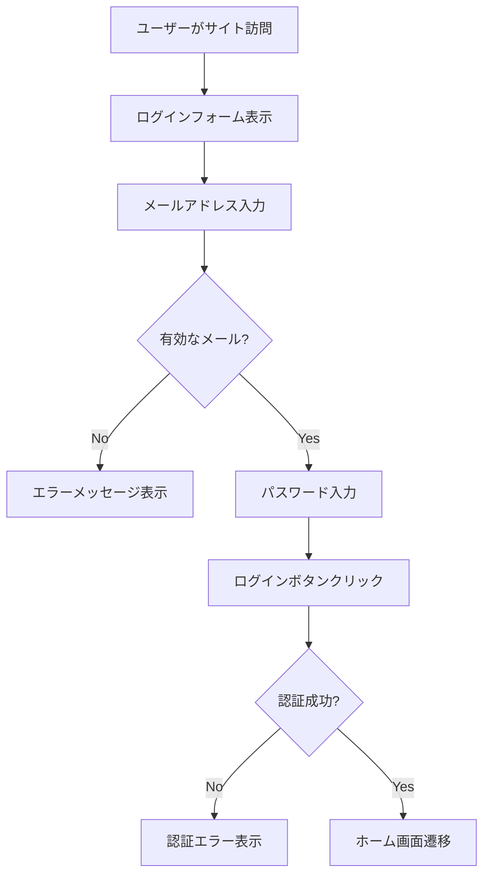

# テスト自動化のブラックボックス問題

## 🕳️ あなたが指摘したブラックボックス問題

### AIテストの不透明性

```javascript
// AIが生成したテストコード
test('ユーザー登録機能', async () => {
  await page.fill('#username', 'testuser');
  await page.fill('#password', 'password123');
  await page.click('#submit');
  await expect(page.locator('#success')).toBeVisible();
});

// 問題:
// 1. このテストは正しい？
// 2. エッジケースを考慮してる？
// 3. 実際の画面操作が見えない
// 4. なぜこのテストなのか理由不明
```

### 見えない実行プロセス

```
テスト実行中:
[●●●●●●●] 実行中...

何が起きてる？
- どの画面をテストしてる？
- どのボタンを押してる？  
- エラーが出てるけど正常？
- データはどう入力されてる？

→ 完全にブラックボックス
```

## 🔍 現在のテスト可視化技術

### Playwright Trace Viewer

```javascript
// テスト実行の完全記録
test('ログイン', async ({ page }) => {
  await page.goto('/login');
  await page.fill('#username', 'user');
  await page.fill('#password', 'pass');
  await page.click('#login-button');
});

// 実行後:
// - スクリーンショット各ステップ
// - DOMの変化
// - ネットワーク通信
// - コンソールログ
// すべて時系列で記録

でも...AIが生成したテストの意図は分からない
```

### Cypress Dashboard

```javascript
// リアルタイム実行画面
cy.visit('/app');
cy.get('[data-cy="username"]').type('user'); // ← 実際の入力が見える
cy.get('[data-cy="password"]').type('pass');
cy.get('[data-cy="submit"]').click();

// 問題: 人間が書いたテストなら理解できるが
// AIが書いたテストの判断基準が不明
```

## 🤖 AI時代のテスト透明化アプローチ

### 1. テスト意図の自動説明

```javascript
// AIが生成するテスト + 説明
const testWithReasoning = {
  testCode: `
    await page.fill('#email', 'invalid-email');
    await page.click('#submit');
    await expect(page.locator('.error')).toContain('無効なメール');
  `,
  reasoning: `
    このテストの目的:
    1. 無効なメールアドレスの入力検証
    2. エラーメッセージの表示確認
    3. フォーム送信の阻止確認
    
    なぜこのケース？:
    - メールバリデーションは必須機能
    - ユーザビリティに直結
    - セキュリティにも関連
  `,
  coverage: "バリデーション機能の基本ケース"
};
```

### 2. ユーザーシナリオの可視化



```javascript
// AIがこのフローを理解してテスト生成
const userJourneyTest = generateTestFromFlow(userFlow);
```

### 3. リアルタイム実行解説

```javascript
// テスト実行中の逐次解説
const narrativeTest = {
  step1: {
    action: "page.goto('/login')",
    narrative: "ユーザーがログインページにアクセスしています",
    screenshot: "login_page.png",
    expectation: "ログインフォームが表示されるはず"
  },
  step2: {
    action: "page.fill('#username', 'testuser')",
    narrative: "ユーザー名フィールドに「testuser」を入力しています", 
    screenshot: "username_filled.png",
    expectation: "入力値が正しく表示されるはず"
  }
  // ...
};
```

## 📊 データインプットの課題と解決案

### 現在のテストデータ問題

```javascript
// 固定データの限界
const testData = {
  username: 'testuser',
  email: 'test@example.com',
  password: 'password123'
};

// 問題:
// - 実際のユーザーデータと違う
// - エッジケースを網羅できない
// - 日本語/特殊文字のテストなし
```

### AIによる現実的テストデータ生成

```javascript
// LLMが生成する多様なテストデータ
const realisticTestData = await generateTestData({
  userType: 'japanese_business_user',
  scenarios: [
    'normal_registration',
    'edge_case_validation', 
    'malicious_input',
    'accessibility_user'
  ]
});

// 結果例:
[
  { name: '田中太郎', email: 'tanaka@company.co.jp', age: 35 },
  { name: 'ヴィクトル・フォン・ドゥーム３世', email: 'doom@evil.org' },
  { name: '<script>alert("XSS")</script>', email: 'hacker@bad.com' },
  { name: '', email: '', age: -1 } // 境界値テスト
]
```

### 本番データからの学習

```javascript
// 本番環境のユーザー行動パターンを匿名化して活用
const behaviorPattern = {
  mostCommonPaths: [
    'login → dashboard → profile',
    'register → verify_email → dashboard',
    'forgot_password → reset → login'
  ],
  errorPatterns: [
    'email_format_error: 23%',
    'password_too_short: 18%', 
    'network_timeout: 12%'
  ],
  devicePatterns: [
    'mobile: 60%',
    'desktop: 35%',
    'tablet: 5%'
  ]
};

// これらのパターンに基づいてテスト生成
```

## 🔬 テスト品質の数学的検証

### カバレッジの可視化

```typescript
interface TestCoverage {
  functionalCoverage: {
    userRegistration: 95,
    userLogin: 98,
    passwordReset: 87,
    profileUpdate: 76
  },
  pathCoverage: {
    happyPath: 100,
    errorPath: 85,
    edgeCases: 67
  },
  dataCoverage: {
    validInputs: 90,
    invalidInputs: 88, 
    boundaryValues: 95,
    maliciousInputs: 72
  }
}
```

### 信頼度スコアリング

```javascript
const testReliability = {
  score: calculateReliability({
    testExecutionHistory: "98% pass rate over 30 days",
    codeCoverageData: "87% line coverage",
    realUserComparison: "94% behavior match",
    expertReview: "manual review confirms 92% accuracy"
  }),
  
  confidenceLevel: "92%",
  recommendation: "本番デプロイ可能"
};
```

## 🎯 理想的なテスト環境の提案

### 完全透明なテストシステム

```yaml
TestExecution:
  preparation:
    - "テストシナリオをユーザーストーリーで説明"
    - "使用するテストデータの根拠を明示"
    - "期待する結果を具体的に定義"
  
  execution:
    - "各ステップをリアルタイムで可視化" 
    - "スクリーンショット + 操作説明"
    - "内部状態（DB、API呼び出し）も記録"
  
  verification:
    - "結果の判定ロジックを明示"
    - "なぜOKと判断したかの理由"
    - "見落としている可能性の指摘"
  
  reporting:
    - "人間が理解できる形式で結果報告"
    - "改善提案も含む"
```

## 💡 GASとの組み合わせアイデア

### GASを使ったテスト結果の統合管理

```javascript
// Googleスプレッドシートでテスト結果一元管理
function recordTestResults(testResults) {
  const sheet = SpreadsheetApp.openById('test-results-sheet');
  
  testResults.forEach(result => {
    sheet.appendRow([
      new Date(),
      result.testName,
      result.status,
      result.executionTime,
      result.screenshotUrl,
      result.errorMessage || 'N/A'
    ]);
  });
  
  // 失敗したテストがあればSlackに通知
  const failures = testResults.filter(r => r.status === 'FAILED');
  if (failures.length > 0) {
    notifySlack(`テスト失敗: ${failures.length}件`);
  }
  
  // 週次レポートをGoogleスライドで自動生成
  if (isWeekEnd()) {
    generateWeeklyReport();
  }
}
```

## 🔮 未来の展望

```javascript
// 5年後の理想
const futureTestingPlatform = {
  transparency: "100% - すべてが説明可能",
  reliability: "99.9% - 数学的保証",
  userFriendly: "パワポレベルの操作感",
  intelligence: "人間の直感を超える洞察",
  
  workflow: [
    "自然言語でテスト要求",
    "AIが包括的テストプラン生成",
    "リアルタイム実行可視化", 
    "結果の自動解釈と改善提案",
    "ワンクリックで本番デプロイ"
  ]
};
```

**ブラックボックス問題は確かに最大の課題ですが、技術的には解決可能です。**
**GASのような「過小評価された優秀な道具」を組み合わせることで、より良いソリューションが作れそうですね！**